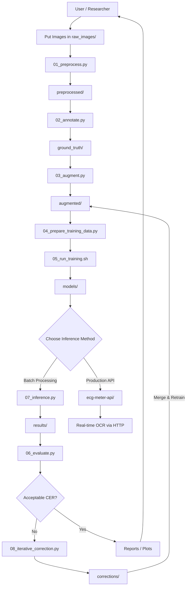

# ECG Postpaid Meter Readings — Tesseract OCR Fine-Tuning Pipeline

A robust, end-to-end pipeline for training/retraining a Tesseract OCR model
specifically optimised for Ghana ECG (Electricity Company of Ghana) postpaid
meter reading images.

---

## Table of Contents
1. [Project Structure](#project-structure)
2. [Quick Start](#quick-start)
3. [Pipeline Phases](#pipeline-phases)
4. [Configuration](#configuration)
5. [Scripts Reference](#scripts-reference)
6. [Evaluation](#evaluation)
7. [Troubleshooting](#troubleshooting)
8. [System Overview](#-system-overview)

---

## Project Structure

```
ecg-ocr-project/
├── raw_images/          # Original meter reading photos
├── preprocessed/        # Cleaned/deskewed images ready for OCR
├── ground_truth/        # .gt.txt label files (paired with .tif)
├── augmented/           # Synthetically augmented images
├── eval_data/           # Dedicated evaluation/test set (optional)
├── corrections/         # Human-corrected samples for iterative retraining
├── results/             # Inference outputs, CSV reports, test_set.txt
├── models/
│   └── ecg_meter/
│       └── tessdata/    # Final .traineddata model installed here
├── tesstrain/           # git submodule — owns all training internals
│   └── data/
│       └── ecg_meter-ground-truth/  # ← 04_prepare_training_data.py writes here
├── ecg-meter-api/       # Production REST API
│   ├── app.py           # Flask application
│   ├── ocr.py           # OCR engine wrapper
│   └── model/           # Trained model (.traineddata)
├── scripts/             # All pipeline scripts
├── config/              # YAML configs
├── logs/                # Training logs, CER curves
├── notebooks/           # Jupyter analysis notebooks
├── tests/               # Unit tests
└── docs/                # Additional documentation
```

---

## Quick Start

```bash
# 1. Clone the repo with the tesstrain submodule
git clone --recurse-submodules <your-repo-url>
cd ecg-ocr-project

# 2.1 READ docs/macos_setup.md
# 2.1 Install system and Python dependencies
bash scripts/install_dependencies.sh

# 3. Configure the project
cp config/config.example.yaml config/config.yaml
# Edit config/config.yaml with your paths

# 4. Preprocess your raw images
python scripts/01_preprocess.py --input raw_images/ --output preprocessed/

# 5. Label your images
python scripts/02_annotate.py --manual --images preprocessed/ --output ground_truth/

# 6. Augment the dataset
python scripts/03_augment.py --input preprocessed/ --output augmented/ --factor 5

# 7. Copy pairs into tesstrain's ground-truth directory
python scripts/04_prepare_training_data.py

# 8. Run fine-tuning via tesstrain
bash scripts/05_run_training.sh

# 9. Evaluate the model
python scripts/06_evaluate.py --model models/ecg_meter/tessdata/ecg_meter.traineddata

# 10. (Optional) Iterative error correction
python scripts/08_iterative_correction.py --find-errors --threshold 0.1
python scripts/08_iterative_correction.py --corrections corrections/ --retrain --rounds 3

# 11. Run inference on new images
python scripts/07_inference.py --input raw_images/new/ --output results/
```

---

## Pipeline Phases

### Phase 1 — Preprocessing
Converts raw meter photos into clean, normalised images:
- Automatic deskew & perspective correction
- Adaptive thresholding (handles glare, shadows)
- ROI (region of interest) extraction (isolates the meter display)
- Upscaling to ≥300 DPI equivalent

### Phase 2 — Annotation
Ground truth labeling with validation:
- Label Studio integration
- Automatic format conversion to `.gt.txt`
- Quality checks on labels

### Phase 3 — Augmentation
Synthetic data generation to expand small datasets:
- Brightness/contrast variation
- Slight rotation & perspective warp
- Gaussian noise & blur
- Morphological degradation

### Phase 4 — Training Data Preparation
Converts annotated images to Tesseract-ready format:
- Paired `.tif` + `.gt.txt` files
- Train/validation/test split (80/10/10)

### Phase 5 — Fine-Tuning
LSTM fine-tuning from `eng` base model via tesstrain:
- Configurable iterations and learning rate
- Checkpoint saving
- Real-time CER monitoring

### Phase 6 — Evaluation
Comprehensive metrics:
- Character Error Rate (CER)
- Word Error Rate (WER)
- Field-level (reading, account number) accuracy
- Confusion matrix for misread characters

### Phase 7 — Inference
Production-ready OCR with:
- Character whitelist for meter domains
- Post-processing validation (regex + business rules)
- Confidence thresholding & human review flagging
- CSV/JSON output

### Phase 7.5 — Iterative Error Correction (Optional)
Continuous model improvement through error analysis:
- Identify worst-performing samples from evaluation
- Present failures for human review and correction
- Add corrected samples to `corrections/` directory
- Merge corrections into training set
- Trigger incremental retraining cycles
- Re-evaluate and track CER improvements
- Repeat until target accuracy achieved

### Phase 8 — API Deployment
Production REST API for real-time OCR:
- Flask-based HTTP endpoint
- Image upload via POST multipart/form-data
- Automatic preprocessing pipeline
- JSON response with readings, confidence scores
- Health check endpoint

---

## Production API Usage

The `ecg-meter-api/` directory contains a lightweight Flask API for production deployment.

### Starting the API

```bash
cd ecg-meter-api
python app.py
```

The API will start on `http://127.0.0.1:5000`

### API Endpoints

**POST /read-meter**
- Upload meter image and get OCR results
- **Content-Type**: `multipart/form-data`
- **Field name**: `image`
- **Supported formats**: .jpg, .jpeg, .png, .tif, .tiff, .bmp
- **Max size**: 10MB

**Example using curl:**
```bash
curl -X POST http://127.0.0.1:5000/read-meter \
  -F "image=@/path/to/meter.jpg"
```

**Response:**
```json
{
  "raw_text": "00005",
  "meter_readings": ["00005"],
  "meter_serial": [],
  "account_numbers": [],
  "dates": [],
  "confidence": 95.2,
  "flagged": false
}
```

**GET /health**
- Health check endpoint
- Returns: `{"status": "ok"}`

### Deploying to Production

For production deployment, use a WSGI server like Gunicorn:

```bash
pip install gunicorn
gunicorn -w 4 -b 0.0.0.0:8000 app:app
```

Or use Docker (see `ecg-meter-api/Dockerfile` if available).

---

## Configuration

Edit `config/config.yaml`:

```yaml
model:
  name: ecg_meter
  base_model: eng
  max_iterations: 10000
  learning_rate: 0.0001
  target_cer: 0.02

training:
  split: [0.80, 0.10, 0.10]
  augmentation_factor: 5

preprocessing:
  target_dpi: 300
  adaptive_thresh_block_size: 11
  adaptive_thresh_c: 2
  min_image_width: 800

ocr:
  psm: 6
  oem: 1
  whitelist: "0123456789.-kWhKWH/ABCDEFGHIJKLMNOPQRSTUVWXYZ "
  confidence_threshold: 60
```

---

## Scripts Reference

| Script | Purpose |
|--------|---------|
| `01_preprocess.py` | Image cleaning, deskew, ROI extraction |
| `02_annotate.py` | Label Studio launcher + format converter |
| `03_augment.py` | Synthetic data augmentation |
| `04_prepare_training_data.py` | Build tesstrain-ready file pairs |
| `05_run_training.sh` | Execute tesstrain fine-tuning |
| `06_evaluate.py` | Full evaluation with metrics |
| `07_inference.py` | Production inference pipeline |
| `08_iterative_correction.py` | dshea89-style error correction loop |
| `install_dependencies.sh` | System + Python dependency installer |
| `plot_training_curves.py` | Visualise CER/WER over training |

---

## Evaluation

The `06_evaluate.py` script provides comprehensive model evaluation with detailed metrics.

### Basic Usage

```bash
# Evaluate with default settings (uses eval_data/ directory)
python scripts/06_evaluate.py --model models/ecg_meter/tessdata/ecg_meter.traineddata

# Use augmented dataset for evaluation (if no separate eval_data/)
python scripts/06_evaluate.py \
  --model models/ecg_meter/tessdata/ecg_meter.traineddata \
  --test-dir augmented/

# Compare custom model against base eng model
python scripts/06_evaluate.py \
  --model models/ecg_meter/tessdata/ecg_meter.traineddata \
  --test-dir augmented/ \
  --compare
```

**Note:** Use `eval_data/` for a dedicated holdout test set, or use `augmented/` if you want to evaluate on your augmented training data.

### Command Reference

```
--test-dir DIR      Test images directory (default: eval_data/)
--gt-dir DIR        Ground truth directory (default: ground_truth/)
--model FILE        Path to .traineddata model file
--lang LANG         Tesseract language code (default: eng)
--output DIR        Output directory for reports (default: results/)
--compare           Compare against base eng model
--config FILE       Path to config.yaml (default: config/config.yaml)
```

### Metrics Computed

- **Character Error Rate (CER)**: Levenshtein distance at character level
- **Word Error Rate (WER)**: Levenshtein distance at word level
- **Field-level accuracy**: Meter reading, account number, date extraction
- **Per-character confusion matrix**: Which characters are commonly misread
- **Confidence score distribution**: OCR confidence levels

### Output Files

All evaluation results are saved to `results/`:
- `evaluation_report.csv`: Detailed per-image metrics
- `confusion_matrix.png`: Character error visualization
- `cer_distribution.png`: CER histogram across test set
- Console summary with rich tables

### Interpreting Results

| CER Range | Quality | Action |
|-----------|---------|--------|
| < 1% | Excellent | Deploy to production |
| 1-3% | Good | Optional iterative correction |
| 3-5% | Acceptable | Run iterative correction |
| > 5% | Poor | Review preprocessing & add more training data |

---

## Troubleshooting

**Low accuracy on specific meter brands**
Add more images of that meter type. ECG uses Actaris, Landis+Gyr, and Conlog
meters — each has different digit fonts.

**High CER despite large dataset**
Check preprocessing: glare, perspective distortion, and low contrast are the
most common culprits. Run `scripts/01_preprocess.py --debug` to visualise each
preprocessing step.

**Training loss not decreasing**
Lower `learning_rate` to `0.00005` or reduce `max_iterations` if overfitting.

**Tesseract not found**
Run `bash scripts/install_dependencies.sh` and ensure `/usr/bin/tesseract` is
on your PATH.

## 📊 System Overview

This project follows a structured OCR pipeline:

- Image preprocessing
- Annotation & augmentation
- Model training (tesstrain)
- Inference & evaluation

Detailed diagrams are available in `/docs`.

### User Flow
Shows how a user uses your ECG OCR system end-to-end.


