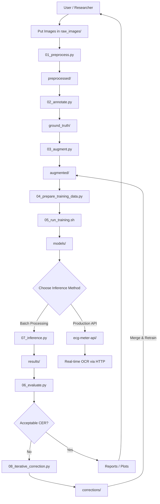

# ECG Postpaid Meter Readings — Tesseract OCR Fine-Tuning Pipeline

A robust, end-to-end pipeline for training/retraining a Tesseract OCR model
specifically optimised for Ghana ECG (Electricity Company of Ghana) postpaid
meter reading images.

---

## Table of Contents
1. [Project Structure](#project-structure)
2. [Quick Start](#quick-start)
3. [Makefile Reference](#makefile-reference)
4. [Pipeline Phases](#pipeline-phases)
5. [Configuration](#configuration)
6. [Scripts Reference](#scripts-reference)
7. [Notebooks](#notebooks)
8. [Evaluation](#evaluation)
9. [Troubleshooting](#troubleshooting)
10. [System Overview](#-system-overview)

---

## Project Structure

```
ecg-ocr-project/
├── Makefile             # Convenient shortcuts for all pipeline operations (make help)
├── raw_images/          # Original meter reading photos
├── preprocessed/        # Cleaned/deskewed images ready for OCR
├── ground_truth/        # .gt.txt label files (paired with .tif)
├── augmented/           # Synthetically augmented images
├── eval_data/           # Holdout test set (auto-populated by 04_prepare_training_data.py)
├── corrections/         # Human-corrected samples for iterative retraining
├── results/             # Inference outputs, CSV reports, test_set.txt
├── models/
│   └── ecg_meter/
│       └── tessdata/    # Final .traineddata model installed here
├── tesstrain/           # git submodule — owns all training internals
│   └── data/
│       └── ecg_meter-ground-truth/  # ← 04_prepare_training_data.py writes here
├── ecg-meter-api/       # Production REST API
│   ├── app.py           # Flask application
│   ├── ocr.py           # OCR engine wrapper
│   └── model/           # Trained model (.traineddata)
├── scripts/             # All pipeline scripts
├── config/              # YAML configs
├── logs/                # Training logs, CER curves
├── notebooks/
│   └── ecg_ocr_analysis.ipynb  # Interactive dataset analysis & preprocessing visualisation
├── tests/               # Unit tests
└── docs/                # Additional documentation
```

---

## Quick Start

```bash
# 1. Clone the repo with the tesstrain submodule
git clone --recurse-submodules <your-repo-url>
cd ecg-ocr-project

# 2.1 READ docs/macos_setup.md
# 2.1 Install system and Python dependencies
bash scripts/install_dependencies.sh

# 3. Configure the project
cp config/config.example.yaml config/config.yaml
# Edit config/config.yaml with your paths

# 4. Preprocess your raw images
python scripts/01_preprocess.py --input raw_images/ --output preprocessed/

# 5. Label your images
# Option A: GUI-based (Label Studio)
python scripts/02_annotate.py --launch --images preprocessed/
# Option B: CLI-based (quick for small datasets)
python scripts/02_annotate.py --manual --images preprocessed/ --output ground_truth/

# 6. Augment the dataset
python scripts/03_augment.py --input preprocessed/ --output augmented/ --factor 5

# 7. Copy pairs into tesstrain's ground-truth directory
# This also splits data: train+val → tesstrain/, test → eval_data/
python scripts/04_prepare_training_data.py

# 8. Run fine-tuning via tesstrain
bash scripts/05_run_training.sh

# 9. Evaluate the model
python scripts/06_evaluate.py --model models/ecg_meter/tessdata/ecg_meter.traineddata

# (Optional) Add additional test images to eval_data/
python scripts/add_to_eval_data.py --image new_meter.jpg --interactive

# 10. (Optional) Iterative error correction
python scripts/08_iterative_correction.py --find-errors --threshold 0.1
python scripts/08_iterative_correction.py --corrections corrections/ --retrain --rounds 3

# 11. Run inference on new images
python scripts/07_inference.py --input raw_images/new/ --output results/
```

---

## Makefile Reference

The `Makefile` wraps every pipeline step so you don't need to remember long command strings.

```bash
make help          # Print all available targets
```

| Target | Description |
|--------|-------------|
| `make setup` | Install all system + Python dependencies |
| `make preprocess` | Run `01_preprocess.py` on `raw_images/` → `preprocessed/` |
| `make annotate` | Launch CLI annotation tool (`02_annotate.py --manual`) |
| `make annotate-studio` | Launch Label Studio GUI for annotation |
| `make validate-gt` | Validate all `.gt.txt` files for common errors |
| `make augment` | Run `03_augment.py` with factor 5 |
| `make prepare` | Run `04_prepare_training_data.py` |
| `make stats` | Print dataset statistics without copying any files |
| `make train` | Run `05_run_training.sh` |
| `make train-resume` | Resume training from the last checkpoint |
| `make evaluate` | Run `06_evaluate.py` on `eval_data/` |
| `make evaluate-compare` | Evaluate and compare against the base `eng` model |
| `make infer` | Run `07_inference.py` on `raw_images/` and save CSV output |
| `make correct` | Run 3 rounds of iterative error correction |
| `make find-errors` | Identify high-CER samples (threshold 0.10) |
| `make plot-curves` | Plot CER/WER curves from the latest training log |
| `make test` | Run the test suite with pytest |
| `make test-cov` | Run tests with HTML coverage report |
| `make full-pipeline` | Shortcut: preprocess → augment → prepare → train → evaluate |
| `make clean` | Remove generated files (raw images + ground truth are preserved) |

---

## Pipeline Phases

### Phase 1 — Preprocessing
Converts raw meter photos into clean, normalised images:
- Automatic deskew & perspective correction
- Adaptive thresholding (handles glare, shadows)
- ROI (region of interest) extraction (isolates the meter display)
- Upscaling to ≥300 DPI equivalent

### Phase 2 — Annotation
Ground truth labeling with validation:
- Label Studio GUI integration (`--launch` mode) for browser-based annotation
- Built-in CLI annotation tool (`--manual` mode) for quick terminal-based labeling
- Automatic format conversion to `.gt.txt`
- Quality checks on labels

### Phase 3 — Augmentation
Synthetic data generation to expand small datasets:
- Brightness/contrast variation
- Slight rotation & perspective warp
- Gaussian noise & blur
- Morphological degradation

### Phase 4 — Training Data Preparation
Converts annotated images to Tesseract-ready format:
- Paired `.tif` + `.gt.txt` files
- Train/validation/test split (80/10/10 by default)
- Training pairs → `tesstrain/data/<model>-ground-truth/`
- Test pairs → `eval_data/` (held out for unbiased evaluation)

### Phase 5 — Fine-Tuning
LSTM fine-tuning from `eng` base model via tesstrain:
- Configurable iterations and learning rate
- Checkpoint saving
- Real-time CER monitoring

### Phase 6 — Evaluation
Comprehensive metrics:
- Character Error Rate (CER)
- Word Error Rate (WER)
- Field-level (reading, account number) accuracy
- Confusion matrix for misread characters

### Phase 7 — Inference
Production-ready OCR with:
- Character whitelist for meter domains
- Post-processing validation (regex + business rules)
- Confidence thresholding & human review flagging
- CSV/JSON output

### Phase 7.5 — Iterative Error Correction (Optional)
Continuous model improvement through error analysis:
- Identify worst-performing samples from evaluation
- Present failures for human review and correction
- Add corrected samples to `corrections/` directory
- Merge corrections into training set
- Trigger incremental retraining cycles
- Re-evaluate and track CER improvements
- Repeat until target accuracy achieved

### Phase 8 — API Deployment
Production REST API for real-time OCR:
- Flask-based HTTP endpoint
- Image upload via POST multipart/form-data
- Automatic preprocessing pipeline
- JSON response with readings, confidence scores
- Health check endpoint

---

## Production API Usage

The `ecg-meter-api/` directory contains a lightweight Flask API for production deployment.

### Starting the API

```bash
cd ecg-meter-api
python app.py
```

The API will start on `http://127.0.0.1:5000`

### API Endpoints

**POST /read-meter**
- Upload meter image and get OCR results
- **Content-Type**: `multipart/form-data`
- **Field name**: `image`
- **Supported formats**: .jpg, .jpeg, .png, .tif, .tiff, .bmp
- **Max size**: 10MB

**Example using curl:**
```bash
curl -X POST http://127.0.0.1:5000/read-meter \
  -F "image=@/path/to/meter.jpg"
```

**Response:**
```json
{
  "raw_text": "00005",
  "meter_readings": ["00005"],
  "meter_serial": [],
  "account_numbers": [],
  "dates": [],
  "confidence": 95.2,
  "flagged": false
}
```

**GET /health**
- Health check endpoint
- Returns: `{"status": "ok"}`

### Deploying to Production

For production deployment, use a WSGI server like Gunicorn:

```bash
pip install gunicorn
gunicorn -w 4 -b 0.0.0.0:8000 app:app
```

Or use Docker (see `ecg-meter-api/Dockerfile` if available).

---

## Configuration

Edit `config/config.yaml`:

```yaml
model:
  name: ecg_meter
  base_model: eng
  max_iterations: 10000
  learning_rate: 0.0001
  target_cer: 0.02

training:
  split: [0.80, 0.10, 0.10]
  augmentation_factor: 5

preprocessing:
  target_dpi: 300
  adaptive_thresh_block_size: 11
  adaptive_thresh_c: 2
  min_image_width: 800

ocr:
  psm: 6
  oem: 1
  whitelist: "0123456789.-kWhKWH/ABCDEFGHIJKLMNOPQRSTUVWXYZ "
  confidence_threshold: 60
```

---

## Scripts Reference

| Script | Purpose |
|--------|---------|
| `01_preprocess.py` | Image cleaning, deskew, ROI extraction |
| `02_annotate.py` | Label Studio launcher + format converter |
| `03_augment.py` | Synthetic data augmentation |
| `04_prepare_training_data.py` | Build tesstrain-ready file pairs |
| `05_run_training.sh` | Execute tesstrain fine-tuning |
| `06_evaluate.py` | Full evaluation with metrics |
| `07_inference.py` | Production inference pipeline |
| `08_iterative_correction.py` | dshea89-style error correction loop |
| `add_to_eval_data.py` | Add new images to eval_data/ for testing |
| `install_dependencies.sh` | System + Python dependency installer |
| `plot_training_curves.py` | Visualise CER/WER over training |

---

## Notebooks

### `notebooks/ecg_ocr_analysis.ipynb`

An interactive Jupyter notebook for exploring the dataset, visualising the
preprocessing pipeline, and inspecting OCR results.

```bash
# Open in VS Code
code notebooks/ecg_ocr_analysis.ipynb

# Or launch Jupyter in the browser
jupyter lab notebooks/ecg_ocr_analysis.ipynb
```

**What it covers:**
- Dataset overview — image counts across `preprocessed/`, `augmented/`, `ground_truth/`, and `tesstrain/data/ecg_meter-ground-truth/`
- Step-by-step preprocessing visualisation (resize → deskew → perspective correction → threshold → denoise → ROI)
- Ground truth text distribution and length analysis
- OCR results comparison across different pipeline stages

---

## Evaluation

The `06_evaluate.py` script provides comprehensive model evaluation with detailed metrics.

### Basic Usage

```bash
# Evaluate on the holdout test set (populated by 04_prepare_training_data.py)
python scripts/06_evaluate.py --model models/ecg_meter/tessdata/ecg_meter.traineddata

# Compare custom model against base eng model
python scripts/06_evaluate.py \
  --model models/ecg_meter/tessdata/ecg_meter.traineddata \
  --compare
```

**Note:** The `eval_data/` directory contains your held-out test set (10% of data by default), which was never seen during training. This gives an unbiased estimate of model performance.

### Adding New Test Images

To test your model on completely new images (not from your original dataset):

```bash
# Add a single image (interactive annotation)
python scripts/add_to_eval_data.py --image new_meter.jpg --interactive

# Add a directory of images with existing ground truth files
python scripts/add_to_eval_data.py \
  --input new_test_images/ \
  --gt-dir ground_truth_labels/

# Add images without annotation (for inference testing only)
python scripts/add_to_eval_data.py \
  --input new_test_images/ \
  --no-annotation
```

This preprocesses the images and saves them to `eval_data/` in the correct format (.tif + .gt.txt).

### Command Reference

```
--test-dir DIR      Test images directory (default: eval_data/)
--gt-dir DIR        Ground truth directory (default: ground_truth/)
--model FILE        Path to .traineddata model file
--lang LANG         Tesseract language code (default: eng)
--output DIR        Output directory for reports (default: results/)
--compare           Compare against base eng model
--config FILE       Path to config.yaml (default: config/config.yaml)
```

### Metrics Computed

- **Character Error Rate (CER)**: Levenshtein distance at character level
- **Word Error Rate (WER)**: Levenshtein distance at word level
- **Field-level accuracy**: Meter reading, account number, date extraction
- **Per-character confusion matrix**: Which characters are commonly misread
- **Confidence score distribution**: OCR confidence levels

### Output Files

All evaluation results are saved to `results/`:
- `evaluation_report.csv`: Detailed per-image metrics
- `confusion_matrix.png`: Character error visualization
- `cer_distribution.png`: CER histogram across test set
- Console summary with rich tables

### Interpreting Results

| CER Range | Quality | Action |
|-----------|---------|--------|
| < 1% | Excellent | Deploy to production |
| 1-3% | Good | Optional iterative correction |
| 3-5% | Acceptable | Run iterative correction |
| > 5% | Poor | Review preprocessing & add more training data |

---

## Troubleshooting

**Low accuracy on specific meter brands**
Add more images of that meter type. ECG uses Actaris, Landis+Gyr, and Conlog
meters — each has different digit fonts.

**High CER despite large dataset**
Check preprocessing: glare, perspective distortion, and low contrast are the
most common culprits. Run `scripts/01_preprocess.py --debug` to visualise each
preprocessing step.

**Training loss not decreasing**
Lower `learning_rate` to `0.00005` or reduce `max_iterations` if overfitting.

**Tesseract not found**
Run `bash scripts/install_dependencies.sh` and ensure `/usr/bin/tesseract` is
on your PATH.

## 📊 System Overview

This project follows a structured OCR pipeline:

- Image preprocessing
- Annotation & augmentation
- Model training (tesstrain)
- Inference & evaluation

Detailed diagrams are available in `/docs`.

### User Flow
Shows how a user uses the ECG OCR system end-to-end.


```mermaid
flowchart TD
    U[User / Researcher]

    U --> A[Put Images in raw_images/]
    A --> B[01_preprocess.py]
    B --> C[preprocessed/]

    C --> D[02_annotate.py]
    D --> E[ground_truth/]

    E --> F[03_augment.py]
    F --> G[augmented/]

    G --> H[04_prepare_training_data.py]

    H --> I[05_run_training.sh]
    I --> J[models/]

    J --> K{Choose Inference Method}
    K -->|Batch Processing| L[07_inference.py]
    K -->|Production API| M[ecg-meter-api/]
    
    L --> N[results/]
    M --> O[Real-time OCR via HTTP]

    N --> P[06_evaluate.py]
    P --> Q{Acceptable CER?}
    
    Q -->|No| R[08_iterative_correction.py]
    R --> S[corrections/]
    S -->|Merge & Retrain| G
    
    Q -->|Yes| T[Reports / Plots]
    T --> U
```
