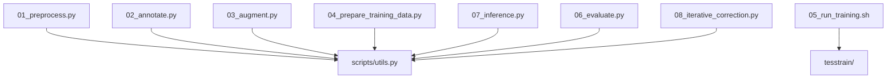

## System Architecture
High-level component relationships.

```mermaid
flowchart LR

    USER[User]

    USER --> RAW[raw_images/]

    RAW --> PRE[scripts/01_preprocess.py]
    PRE --> PREP[preprocessed/]

    PREP --> ANN[scripts/02_annotate.py]
    ANN --> GT[ground_truth/]

    GT --> AUG[scripts/03_augment.py]
    AUG --> AUGD[augmented/]

    AUGD --> PREP2[scripts/04_prepare_training_data.py]

    PREP2 --> TRAIN[tesstrain/ + 05_run_training.sh]
    TRAIN --> MODEL[models/]

    MODEL --> INF[scripts/07_inference.py]
    INF --> RES[results/]

    RES --> EVAL[scripts/06_evaluate.py]
```

## Script Dependency Diagram
How Python scripts depend on each other.

```mermaid
flowchart TD

    U[scripts/utils.py]

    P[01_preprocess.py] --> U
    A[02_annotate.py] --> U
    G[03_augment.py] --> U
    D[04_prepare_training_data.py] --> U
    I[07_inference.py] --> U
    E[06_evaluate.py] --> U
    C[08_iterative_correction.py] --> U

    TRAIN[05_run_training.sh] --> TES[tesstrain/]
```