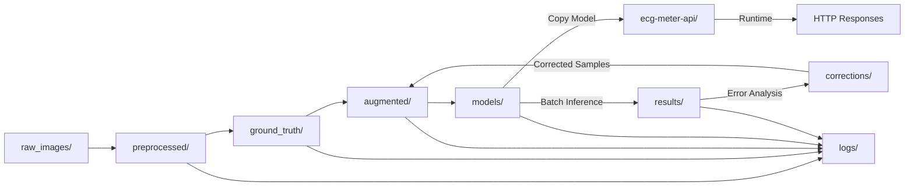

## Data Flow Diagram
Where files go and how they transform.

```mermaid
flowchart LR

    RAW[raw_images/]
    PREP[preprocessed/]
    GT[ground_truth/]
    AUG[augmented/]
    CORR[corrections/]
    MOD[models/]
    RES[results/]
    API[ecg-meter-api/]
    LOG[logs/]

    RAW --> PREP
    PREP --> GT
    GT --> AUG
    AUG --> MOD
    
    MOD -->|Copy Model| API
    MOD -->|Batch Inference| RES
    
    RES -->|Error Analysis| CORR
    CORR -->|Corrected Samples| AUG
    
    API -->|Runtime| HTTP[HTTP Responses]

    PREP --> LOG
    GT --> LOG
    AUG --> LOG
    MOD --> LOG
    RES --> LOG
```