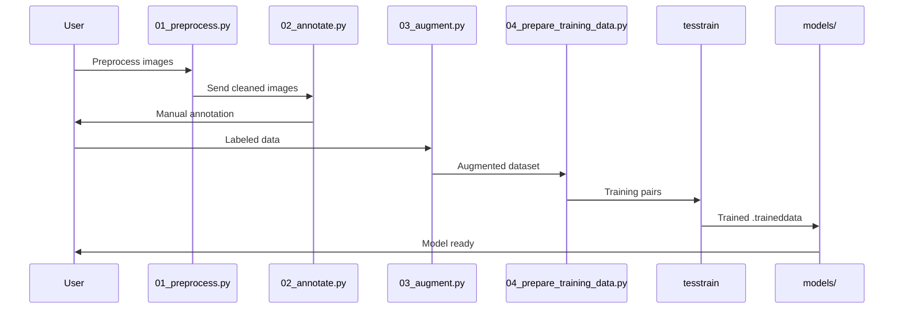
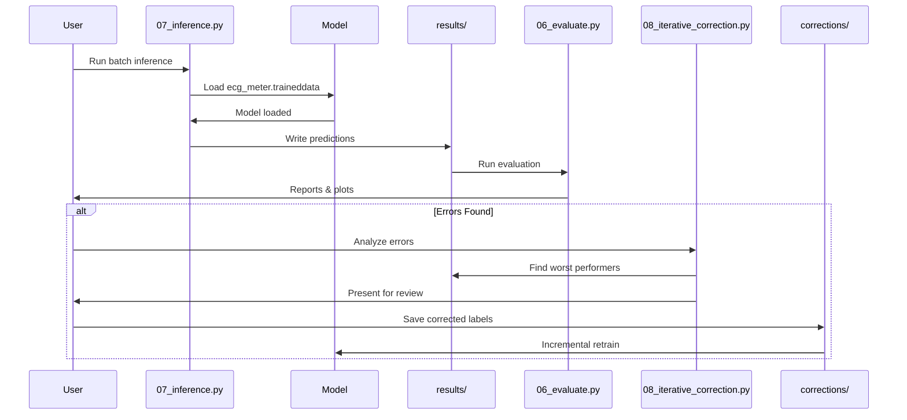
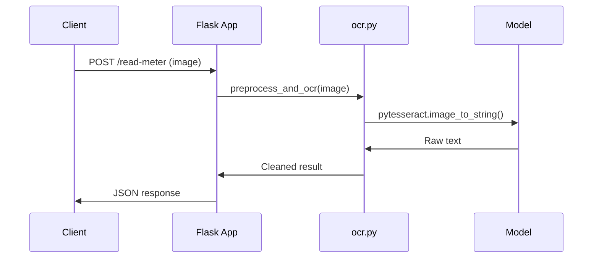

## Runtime Sequence — Training Pipeline
Execution order when training the model.

## Runtime Sequence — Batch Inference
Execution order for batch processing.

## Runtime Sequence — Production API
Execution order for real-time API requests.

