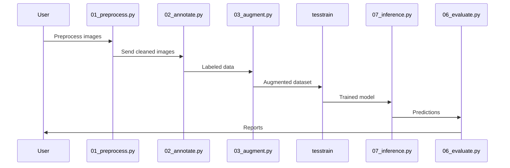

## Runtime Sequence
Execution order when running OCR.

```mermaid
sequenceDiagram

    participant User
    participant Pre as 01_preprocess.py
    participant Ann as 02_annotate.py
    participant Aug as 03_augment.py
    participant Train as tesstrain
    participant Inf as 07_inference.py
    participant Eval as 06_evaluate.py

    User->>Pre: Preprocess images
    Pre->>Ann: Send cleaned images
    Ann->>Aug: Labeled data
    Aug->>Train: Augmented dataset
    Train->>Inf: Trained model
    Inf->>Eval: Predictions
    Eval->>User: Reports
```