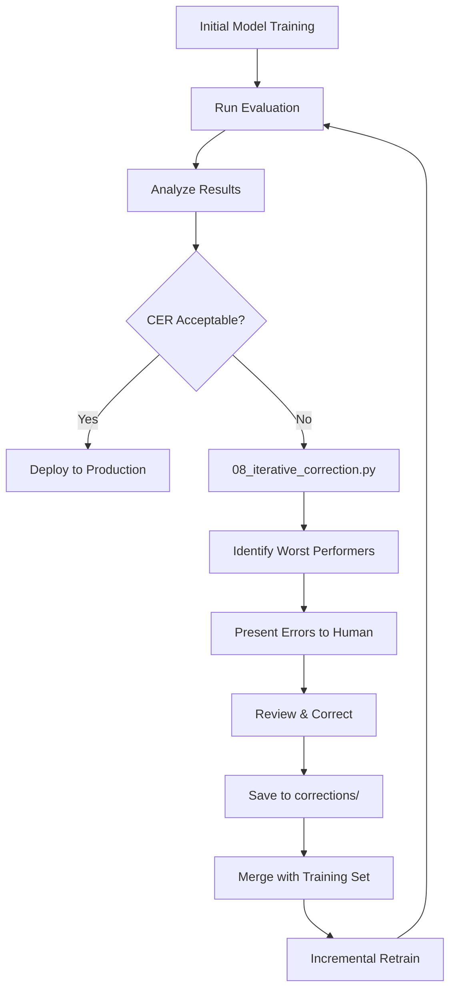

# Iterative Error Correction Workflow

## Overview

The iterative error correction workflow helps continuously improve model accuracy through targeted retraining on problematic samples. Inspired by [dshea89's approach](https://github.com/dshea89/tesseract-retraining-pipeline), this process identifies persistent OCR errors and systematically corrects them.

---

## Workflow Diagram



---

## Usage

### Step 1: Identify Errors

Run evaluation to find problematic images:

```bash
python scripts/08_iterative_correction.py \
  --find-errors \
  --threshold 0.1 \
  --eval-dir eval_data/
```

This identifies all images with CER > 10%.

### Step 2: Run Full Correction Rounds

The script will:
1. Find high-error samples (CER above threshold)
2. Present failures for human correction review
3. Save corrected samples to `corrections/round_XX/`
4. Optionally trigger incremental retraining
5. Repeat for multiple rounds

```bash
python scripts/08_iterative_correction.py \
  --corrections corrections/ \
  --retrain \
  --rounds 3 \
  --threshold 0.1
```

### Step 3: Re-evaluate

After retraining, evaluate again to measure improvement:

```bash
python scripts/06_evaluate.py \
  --model models/ecg_meter/tessdata/ecg_meter.traineddata \
  --test-dir eval_data/
```

---

## Iterative Rounds

Repeat the workflow for multiple rounds:

```bash
python scripts/08_iterative_correction.py \
  --rounds 5 \
  --threshold 0.05 \
  --retrain
```

**Parameters:**
- `--rounds N`: Number of correction cycles (default: 3)
- `--threshold X`: Minimum CER to flag for correction (default: 0.10 = 10%)
- `--retrain`: Trigger retraining after each round of corrections
- `--dry-run`: Simulate retraining without actually running it
- `--progress`: Show iteration progress summary

---

## Best Practices

### When to Use Iterative Correction

✅ **Use when:**
- Initial CER is > 2% on validation set
- Specific character combinations are consistently misread
- Certain meter types/brands have higher error rates
- You have capacity for human review

❌ **Skip if:**
- Initial CER is already < 1%
- Dataset is too small (< 50 images)
- No patterns in errors (random noise)

### Correction Strategies

1. **Focus on high-impact errors:**
   - Prioritize account numbers (11 digits)
   - Prioritize meter readings (affects billing)
   - Deprioritize metadata like dates

2. **Look for patterns:**
   - Same character misread repeatedly → add to corrections
   - Specific meter model failing → collect more of that type
   - Lighting/angle issues → improve preprocessing

3. **Quality over quantity:**
   - 10 well-corrected samples > 100 rushed ones
   - Ensure corrections are absolutely accurate
   - Double-check transcriptions

### Tracking Progress

Create a log to track CER improvements:

| Round | CER Before | CER After | Samples Corrected | Notes |
|-------|------------|-----------|-------------------|-------|
| 0     | 5.2%       | -         | 0                 | Initial model |
| 1     | 5.2%       | 3.1%      | 15                | Fixed '0' vs 'O' confusion |
| 2     | 3.1%       | 1.8%      | 22                | Corrected decimal points |
| 3     | 1.8%       | 0.9%      | 18                | Fixed low-contrast images |
| 4     | 0.9%       | 0.5%      | 12                | Final cleanup |

---

## Directory Structure

```
corrections/
├── round_1/
│   ├── meter_001.tif
│   ├── meter_001.gt.txt
│   ├── meter_042.tif
│   └── meter_042.gt.txt
├── round_2/
│   ├── meter_015.tif
│   └── meter_015.gt.txt
└── correction_log.csv
```

---

## Command Reference

### Available Arguments

```
--eval-dir DIR          Directory containing evaluation images (default: eval_data/)
--gt-dir DIR            Directory containing ground truth .gt.txt files (default: ground_truth/)
--corrections DIR       Directory to save corrected samples (default: corrections/)
--model-dir DIR         Custom Tesseract model directory (optional)
--lang LANG             Tesseract language code (default: eng)
--threshold FLOAT       CER threshold for flagging errors (default: 0.10)
--rounds N              Number of correction rounds (default: 3)
--find-errors           Find and report errors only, don't correct
--retrain               Trigger retraining after collecting corrections
--dry-run               Simulate retraining without actually running it
--progress              Show iteration progress summary
--config FILE           Path to config.yaml (default: config/config.yaml)
```

### Common Usage Patterns

**Find errors only:**
```bash
python scripts/08_iterative_correction.py --find-errors --threshold 0.15
```

**Run full correction cycle with retraining:**
```bash
python scripts/08_iterative_correction.py --retrain --rounds 3
```

**Test workflow without actually retraining:**
```bash
python scripts/08_iterative_correction.py --dry-run --rounds 2
```

**Check progress from previous runs:**
```bash
python scripts/08_iterative_correction.py --progress
```

---

## Automation with Makefile

Use the Makefile targets for streamlined workflows:

```bash
# Find errors and present for correction
make iterative-correction-find

# Add corrections and retrain
make iterative-correction-retrain
```

---

## Advanced: Active Learning

For larger datasets, use active learning strategies:

1. **Uncertainty sampling:** Flag predictions with low confidence scores
2. **Hard negative mining:** Focus on samples near decision boundaries
3. **Diversity sampling:** Ensure corrections cover different meter types

```bash
python scripts/08_iterative_correction.py \
  --threshold 0.15 \
  --rounds 5 \
  --retrain
```

---

## Troubleshooting

### Corrections not improving CER

**Possible causes:**
- Corrections are too similar to existing training data
- Base model (eng) not suitable for domain
- Preprocessing quality issues

**Solutions:**
- Review preprocessing pipeline (01_preprocess.py)
- Increase augmentation diversity
- Consider from-scratch training instead of fine-tuning

### Retraining too slow

**Speed up:**
- Use `--dry-run` to test workflow without actual training
- Reduce the number of rounds
- Edit `config/config.yaml` to reduce `max_iterations` for faster incremental updates

```bash
python scripts/08_iterative_correction.py \
  --rounds 2 \
  --retrain \
  --threshold 0.2
```

### Running out of correction candidates

**Signs you've reached optimal performance:**
- No samples with CER > threshold
- Remaining errors are random/non-systematic
- Diminishing returns (< 0.1% CER improvement per round)

→ **Stop iterating and deploy the model!**

---

## Related Documentation

- [Training Pipeline](training.md)
- [Evaluation Metrics](../README.md#evaluation)
- [Annotation Guidelines](annotation_guide.md)
