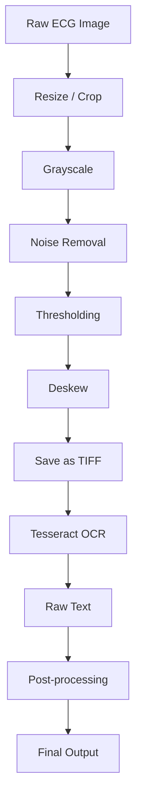

## OCR & Image Processing Pipeline
What happens to each ECG image.

```mermaid
flowchart TD

    A[Raw ECG Image] --> B[Resize / Crop]
    B --> C[Grayscale]
    C --> D[Noise Removal]
    D --> E[Thresholding]
    E --> F[Deskew]

    F --> G[Save as TIFF]
    G --> H[Tesseract OCR]

    H --> I[Raw Text]
    I --> J[Post-processing]
    J --> K[Final Output]
```