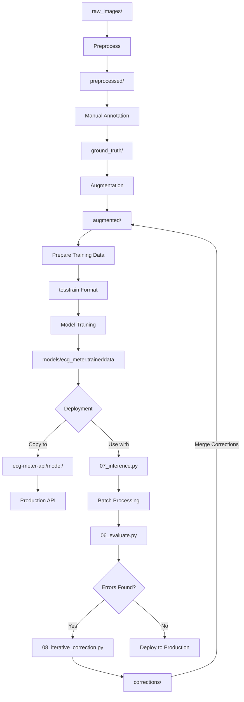

## Training Data Pipeline
How your dataset is built and deployed.

```mermaid
flowchart TD

    A[raw_images/] --> B[Preprocess]
    B --> C[preprocessed/]

    C --> D[Manual Annotation]
    D --> E[ground_truth/]

    E --> F[Augmentation]
    F --> G[augmented/]

    G --> H[Prepare Training Data]
    H --> I[tesstrain Format]

    I --> J[Model Training]
    J --> K[models/ecg_meter.traineddata]
    
    K --> L{Deployment}
    L -->|Copy to| M[ecg-meter-api/model/]
    L -->|Use with| N[07_inference.py]
    
    M --> O[Production API]
    N --> P[Batch Processing]
    
    P --> Q[06_evaluate.py]
    Q --> R{Errors Found?}
    R -->|Yes| S[08_iterative_correction.py]
    S --> T[corrections/]
    T -->|Merge Corrections| G
    R -->|No| U[Deploy to Production]
```